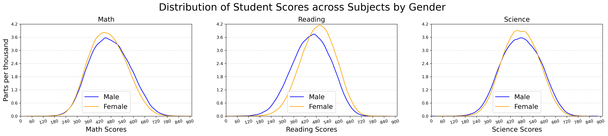

# PISA 2012 Data Analysis - Summary of Key Findings

This analysis is based on a cleaned dataset from the PISA 2012 study, which contains information on student performance as well as socio-economic and educational characteristics. The dataset includes 485,490 students from various countries.

## Dataset

The dataset `pisa2012.csv` can be downloaded as a ZIP file from [here](https://www.google.com/url?q=https://s3.amazonaws.com/udacity-hosted-downloads/ud507/pisa2012.csv.zip&sa=D&ust=1581581520574000).

## Key Findings

### Correlations Between Socioeconomic Status and Student Performance

There is a significant positive correlation between socioeconomic status and performance in mathematics, reading, and science. Socioeconomic status has the strongest correlation with overall performance (correlation coefficient of about 0.4), suggesting that students from higher socioeconomic backgrounds tend to perform better.

### Gender-Specific Differences

There is a minor correlation between gender and performance in mathematics (positive) and reading (negative). This could indicate gender differences in these subject areas.

### Distribution of Scores

The scores in mathematics, reading, science, and the total score show a wide dispersion, indicating a diverse student body with varying levels of ability. The average scores are around 470-480 points in all areas, with a standard deviation of about 95-102 points.

## Visualizations

### Distribution of Student Scores by Gender

The diagrams display the distribution of scores in mathematics, reading, science, and overall, broken down by gender.

### Student Performance Depending on Parental Factors

These diagrams depict the distribution of student performance across different subjects and how they correlate with parental factors such as the level of education, occupational status, and home setup.

## Dictionary of Variables

The following table lists the variables in the dataset and their descriptions:

| Variable       | Description                                                |
| -------------- | ---------------------------------------------------------- |
| Age            | Student's age                                              |
| Occupational   | Highest parental occupational status                        |
| Education      | Highest level of parental education in years               |
| Home Setup     | Household possessions                                      |
| Socioeconomic  | Index of economic, social, and cultural status             |

Please refer to the full dictionary for more details: [Link to the full dictionary](https://www.google.com/url?q=https://s3.amazonaws.com/udacity-hosted-downloads/ud507/pisadict2012.csv&sa=D&ust=1554482573645000)

## Conclusion

The analysis of the PISA 2012 data suggests that socioeconomic status has a significant impact on student performance. In addition, there are indications of gender-specific differences in certain subject areas. The wide range of performance scores reflects the diversity of the student population.

For more detailed investigations, future analyses could further explore the relationships between specific socio-economic indicators and performance in individual subjects, as well as propose interventions aimed at reducing educational inequalities.